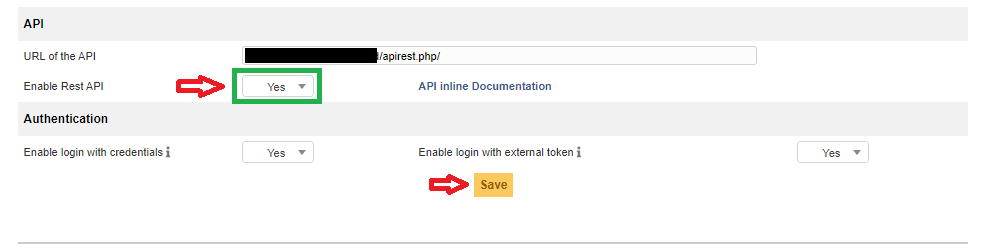
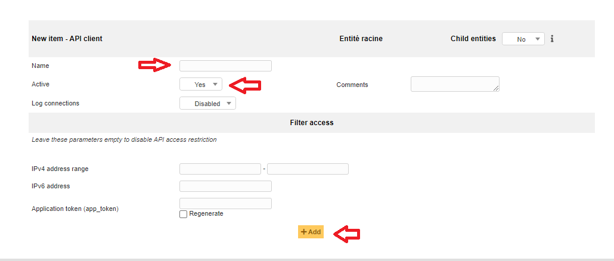
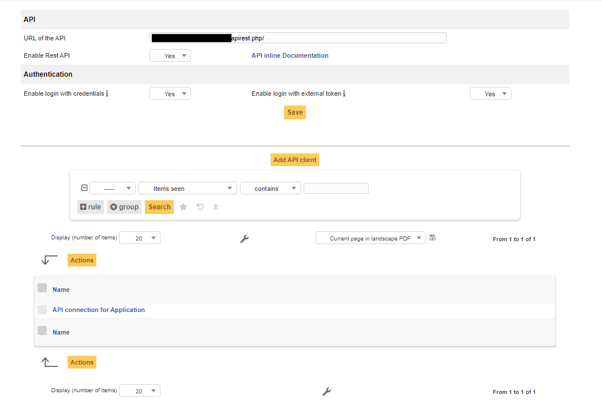
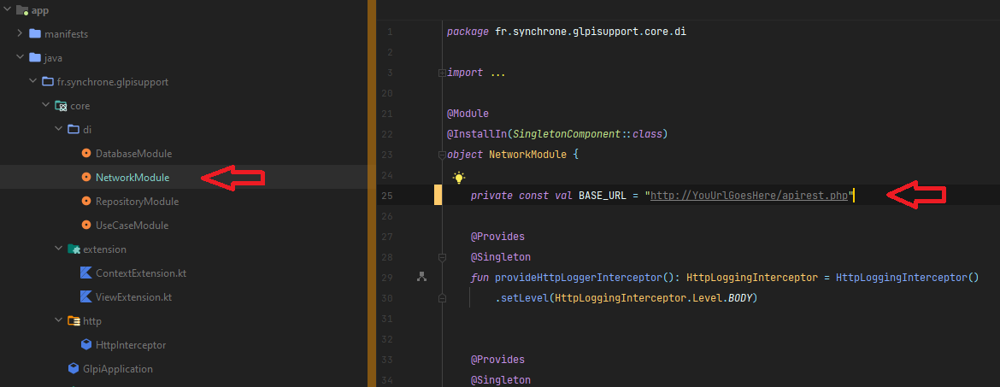

# How To Install and configure Glpi Android Client

You'll have to configure things on the web part of GLPI and on the source code of the android app

## Requirement

- [x] A GLPI admin account
- [x] Android Studio Chimpmunk 2021.2.1 Beta 4 or higher
- [x] An access to you GLPI web platform
- [x] Knowing how to compile Android application with Android Studio
- [x] An Android smartphone

## Glpi Web Part

He we will activate the API of glpi to allow the application to communicate with your server. 

For that part you'll need to connect to your glpi web server throw the UI and go the **Setup** > **General** > **API** 

You can check if API is online and working by clicking on API inline Documentation. If you arrive on a page named : **GLPI REST API: Documentation** you're all good ✔

Then go back to **Setup** > **General** > **API** 

If you want to provide some security, you can set an IP range restriction but be aware that your mobile device where the application will be installed has to be in this range. Leave it empty if you do not want to put some restrictions.

Finally you'll have something like that. 

There we are. Everything is set :clap: :heavy_check_mark::clap:

## Application Part

- [x] git clone https://github.com/SynchroneLab/glpi-android-client
- [x] git pull the main branch
- [x] Open the project in Android Studio

- [x] In the network module change the BASE_URL and change it with the value in URL of the API on the web part
- [x] Generate your APK and install on your phone 
- [x] There we are. Everything is set :clap: :heavy_check_mark::clap::heavy_check_mark:
