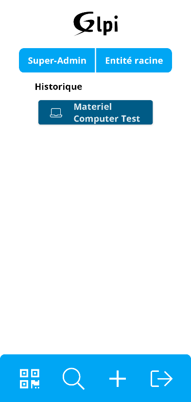
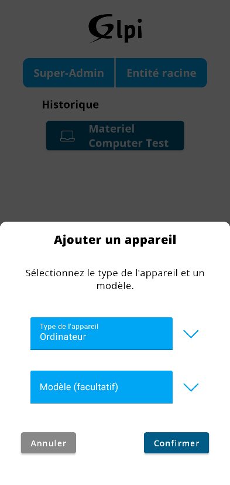
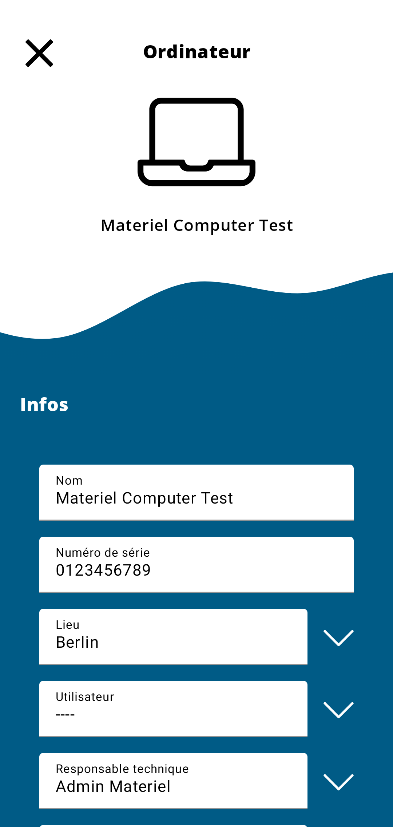
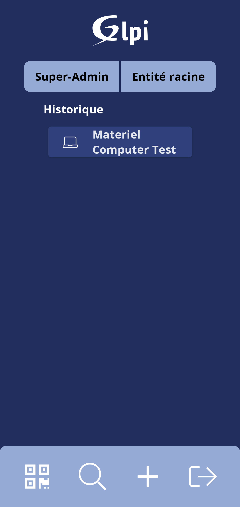
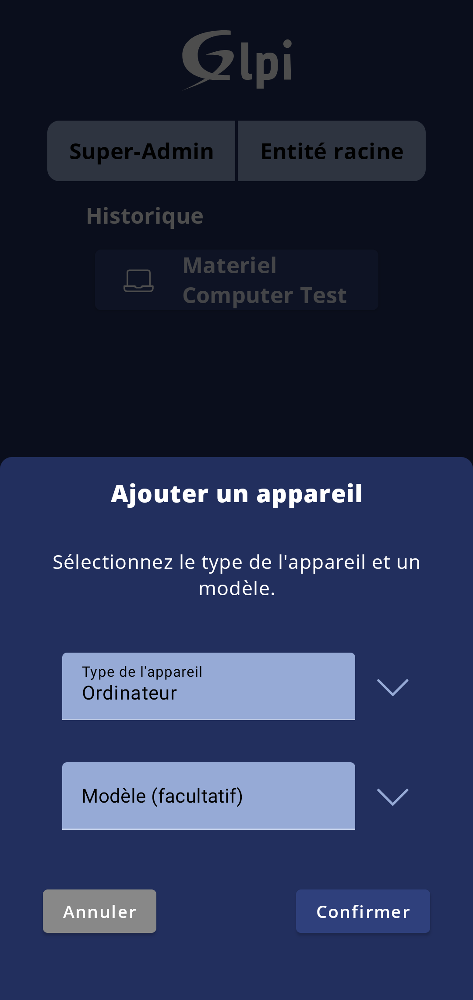
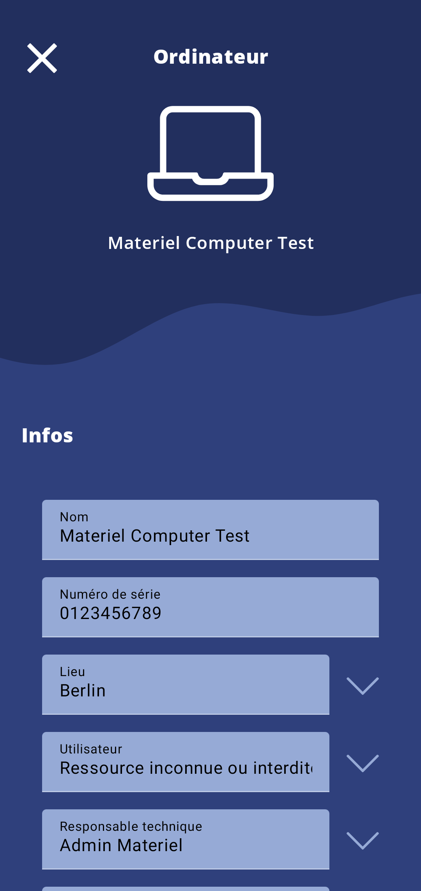

# Glpi Android Client

 
 
 

GLPI Android Client is a Open Source application created by [Synchrone](https://www.synchrone.fr).
It's allow your company to to control, manage, maintain and track all your hardware and licenses directly from your Android device. 

## Functionalities

- [x] Add item 
- [x] Edit item 
- [x] Scan and looking for device with camera 

  - BarCode

  - QRCode

  - Code 128/3/93

  - EAN13/8

  - Aztec

  - ITF

  - UPC A/E

  - PDF 417

  - Data Matrix
- [x] Search item
- [x] Add item from pattern (added before on GLPI)
- [x] Change entities and sub-entities
- [x] Financial and administrative information of an item
- [x] Night & Day theme based on device settings

## Item provided

* Monitor ✔
* Computer ✔
* Phone ✔
* Rack ❌ (not working currently 🐞⚠) 
* Network ✔
* Printer ✔
* Software ✔
* Software Licence ✔

## Compatibility

#### 	GLPI Android Client Version

| GLPI Versions | 9.2+ | 9.3+ | 9.4+ | 9.5+ | 10+  |
| :------------ | :--: | :--: | :--: | :--: | :--: |
| **0.9.0**     |  ✔   |  ✔   |  ✔   |  ✔   |  ❌   |

- Currently working on 10+ API trouble

#### 	Inventory Agent & Android Versions

​		GLPI Android Client is compatible with Android API 23 and target is API 31.

| Tested Android API |  23  |  26  |  29  |  31  |
| :----------------- | :--: | :--: | :--: | :--: |
| **0.9.0**          |  ✔   |  ❔   |  ✔   |  ✔   |

## Documentation

- How to configure the application for your environment, please read the [INSTALL.md](./INSTALL.md)
- If you want to contribute : [CONTRIBUTING.md](./CONTRIBUTING.md) (⚠under construction)

## Screenshots

|                                                              |                                                              |                                                              |
| :----------------------------------------------------------: | :----------------------------------------------------------: | :----------------------------------------------------------: |
|  |  |  |
|  |  |  |

## Versioning

We will try our best to maintain backward compatibility. We will follow [the Semantic Versioning guidelines](http://semver.org/) as much as we can.

Each version of the Glpi Android Client Application will have a changelog associated. See the [tag section](https://github.com/SynchroneLab/glpi-android-client/releases) for further informations

## GLPI Network Based Application

This Android application is based on the [glpi project](https://github.com/glpi-project/glpi) by [teclib](https://www.teclib-edition.com/fr/) and works with the official API given with the project

If there is any trouble with the GLPI part you can inform them on there own github page : [glpi project](https://github.com/glpi-project/glpi)

## Request features

If you have any idea of new features that can be implemented, feel free to contact us by mail to [contact@synchrone-lab.fr](mailto:contact@synchrone-lab.fr?subject=[GitHub%20Glpi%20Android%20Client]).

## Copying

* **Code**: you can redistribute it and/or modify
    it under the terms of the GNU General Public License ([GPLv2](https://www.gnu.org/licenses/gpl-2.0.en.html)).

## Credits

* [Synchrone](https://synchrone.fr)
* Arnault Pascual : Android Tech Lead 
* Quentin Diebold : Software engineer
* Pierrick Bouvier Aubrège : Software engineer